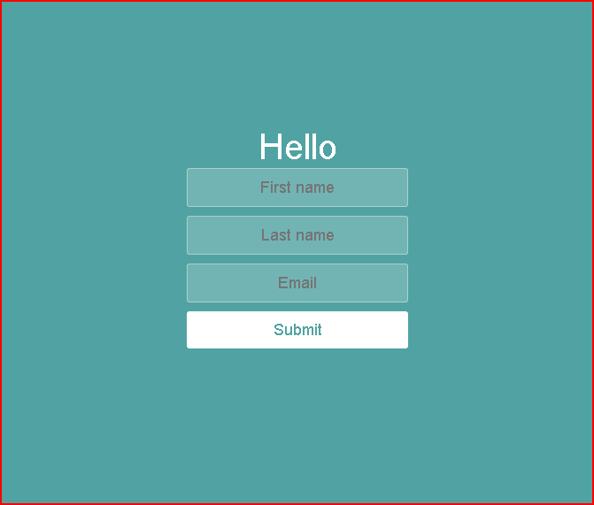
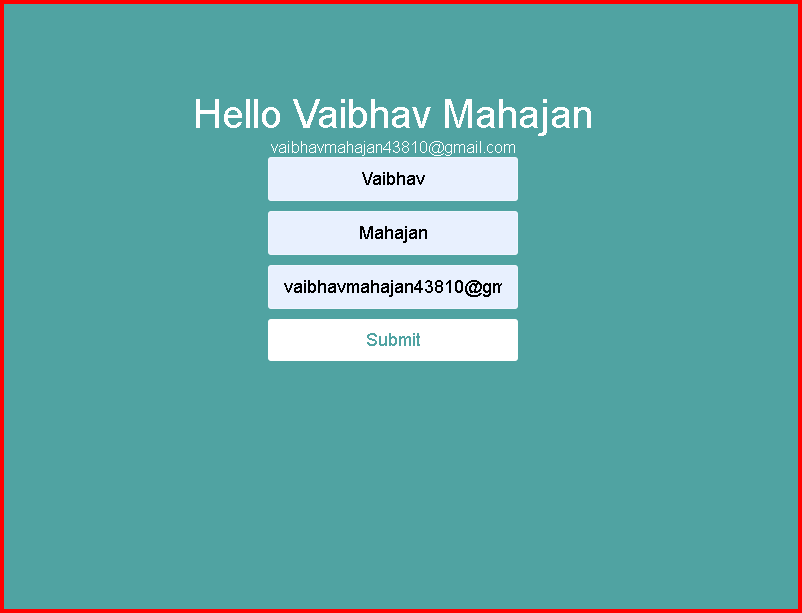

# React Form Component

A simple React component that demonstrates form handling, state management, and hover effects. The component includes a text input field and a submit button that changes color on hover.

