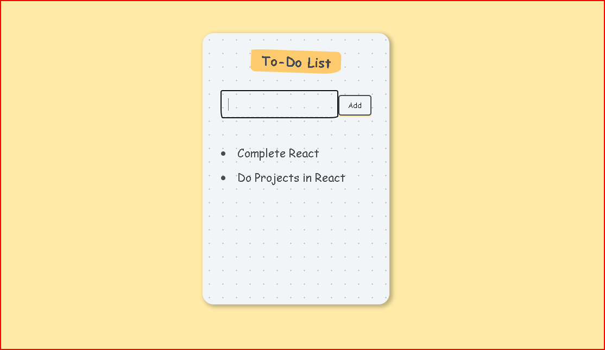

# React Todo List Application

A simple and elegant Todo List application built with React that allows users to add and remove tasks.



## Features

- Add new todo items
- Delete completed tasks
- Clean and minimalist UI
- Persistent state management using React Hooks
- Responsive design

## Project Structure

```
├── src/
│   ├── components/
│   │   ├── App.js
│   │   ├── DisplayTodoComponent.js
│   │   └── InputArea.js
│   └── public/
│       └── styles.css
```

## Components

### App.js
The main component that manages the state and renders the todo list structure.

### DisplayTodoComponent.js
Handles the display and deletion of individual todo items.

### InputArea.js
Manages the input field for adding new todo items.

## Usage

1. Enter a task in the input field
2. Click "Add" or press Enter to add the task to your list
3. Click on a task to mark it as complete and remove it from the list

## State Management

The application uses React's `useState` hook for state management:
- `list`: Stores the array of todo items
- `setList`: Function to update the todo list

## Key Functions

### addItem(item)
Adds a new item to the todo list using the spread operator to maintain immutability.

### deleteItem(id)
Removes an item from the list based on its index using the filter method.

